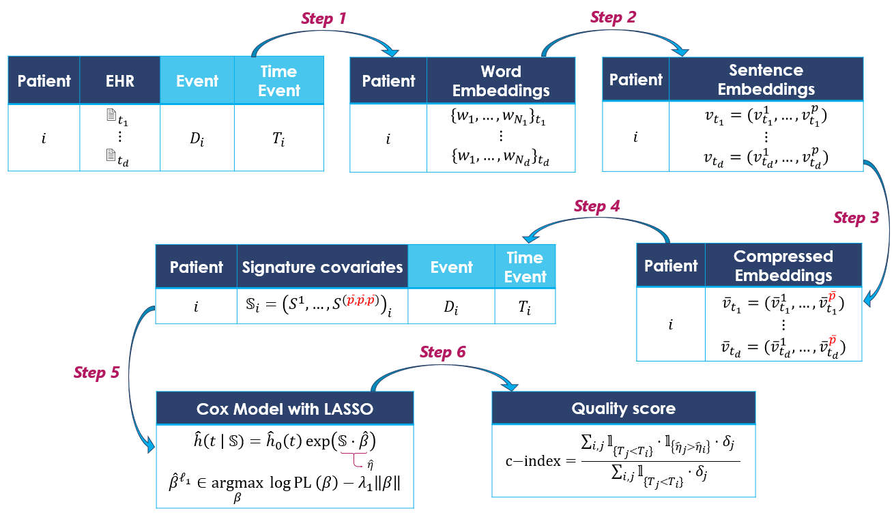

# SigBERT GitHub repo for ECML PKDD 2025

**SigBERT** is a temporal survival analysis pipeline designed to model risk using sequential medical text data. It enables Cox-based survival prediction from a patient's chronological series of clinical reports. It is a ready-to-use framework to leverage sequential medical narratives for time-to-event prediction and applicable to any clinical setting where text reports are timestamped and linked to patient outcomes.

Electronic Health Records (EHR) contain rich narrative content, but traditional survival models often fail to exploit the sequential and geometric structure of this information. SigBERT bridges that gap by combining language modeling with path signature theory.

### Core Idea

  1. **Embedding Clinical Text**: Each timestamped medical report is converted into a sentence embedding by averaging word vectors.  
  2. **Capturing Temporal Structure**: Signature features from rough path theory are extracted from the sequence of embeddings, capturing complex temporal dynamics in patient trajectories.  
  3. **Survival Modeling**: A LASSO-regularized Cox model is trained on these signature features to estimate patient-specific risk scores.

### Real-World Results

SigBERT was evaluated on a large-scale oncology dataset from the [Léon Bérard Center](https://www.centreleonberard.fr/).  
It achieved a **C-index of 0.75** (sd 0.014) on an independent validation cohort.


## Pipeline Overview

Below is a high-level overview of the SigBERT pipeline:



A five-step approach for SigBERT:
* **Step 1** Extract word embeddings from medical reports using OncoBERT.
* **Step 2** Compute sentence embeddings by averaging word embeddings for each report.
* **Step 3** Compress the sentence embeddings through a dimensionality reduction mapping (PCA is used)
* **Step 4** Apply the signature transform to extract coefficients capturing temporal dynamics as covariates.
* **Step 5** Use a Cox model with LASSO regularization to estimate risk scores.

## Project Structure

- `data/`: Place your dataset in this folder. To apply the main notebook [`sigbert_study.ipynb`](./notebooks/sigbert_study.ipynb) to your data, please refer to the [data format documentation](./data/README.md) for the required structure.

- `models/`: Store here the pretrained language models (e.g., OncoBERT, CamemBERT, DrBERT, ...) used to extract word embeddings from clinical text. See the [model documentation](./models/README.md) for expected structure and usage.

- `results/`: Contains all output files generated during experiments, including evaluation plots, result CSVs, and descriptive analyses. The subfolder `descriptive_statistics/` provides additional visualizations summarizing the dataset characteristics.

- `src/`: All core methods for preprocessing, model training, evaluation.
  - `_utils.py`: Utility functions for data preprocessing, cohort filtering, censoring simulations, train/test splitting, and full pipeline orchestration (SigBERT end-to-end).
  - `compression_pkg.py`: Implements PCA-based and custom linear projection methods for compressing high-dimensional embeddings into a lower-dimensional space.
  - `descriptive_stats_pkg.py`: Computes basic descriptive statistics and visualizations for longitudinal survival datasets (e.g., report counts, censoring rates).
  - `metrics_plot_results_pkg.py`: Implements evaluation metrics (C-index, td-AUC, Brier Score, IBS) and statistical plots for survival models, including risk stratification and calibration.
  - `sif_embedding_pkg.py`: Implements the SIF embedding method by Arora et al. (2017), including word weighting, PCA projection removal, and full sentence embedding generation.
  - `signature_pkg.py`: Extracts path signature features from time-indexed embedding sequences, with optional log-signatures, Lévy areas, and missing data encoding.
  - `survival_analysis_pkg.py`: Implements all Cox model training procedures using skglm and lifelines, including preprocessing, LASSO regularization, cross-validation, and detailed survival curve plotting.  
  

- `notebooks/`: Jupyter Notebooks to reproduce each major step:
  - `compute_sent_embd.ipynb`: Computes sentence embeddings from clinical texts using either the CLS Token or Arora et al. method (SIF), based on pre-trained word embeddings.
  - `sigbert_study.ipynb`: Global Notebook. Training and evaluation our survival model SigBERT using path signature features derived from sentence embeddings; includes performance metrics across models.

## Scientific Dependencies

In addition to standard Python packages (`numpy`, `scipy`, `pandas`, `matplotlib`, `seaborn`, `torch`, etc.), our pipeline relies on the following scientific libraries:

### Sentence Embedding

- **[SIF Embedding](https://github.com/PrincetonML/SIF)** — for computing sentence embeddings from word embeddings via a weighted average and principal component removal.

  > Arora, S., Liang, Y., & Ma, T. (2017).  
  > *A Simple but Tough-to-Beat Baseline for Sentence Embeddings*.  
  > International Conference on Learning Representations (ICLR).  
  > [`arxiv.org/abs/1705.02364`](https://arxiv.org/abs/1705.02364)

### Signature Feature Extraction

- **[iisignature](https://pypi.org/project/iisignature/)** — for extracting path signature and log-signature features from time series.

  > Reizenstein, J., & Graham, B. (2018).  
  > *The iisignature library: efficient calculation of iterated-integral signatures and log signatures*.  
  > arXiv preprint. [`arxiv.org/abs/1802.08252`](https://arxiv.org/abs/1802.08252)  
  > An great pdf written by the authors: [`github.com/bottler/phd-docs`](https://github.com/bottler/phd-docs/blob/master/iisignature.pdf)

### Sparse Survival Modeling

- **[skglm](https://contrib.scikit-learn.org/skglm/)** — for efficient Cox model training with L1 regularization.

  > Bertrand, Q., Klopfenstein, Q., Bannier, P.-A., Gidel, G., & Massias, M. (2022).  
  > *Beyond L1: Faster and Better Sparse Models with skglm*.  
  > [`arxiv.org/abs/2204.07826`](https://arxiv.org/abs/2204.07826)

  > Moufad, B., Bannier, P.-A., Bertrand, Q., Klopfenstein, Q., & Massias, M. (2023).  
  > *skglm: Improving scikit-learn for Regularized Generalized Linear Models*.

### Survival Metrics and Modeling

- **[scikit-survival](https://pypi.org/project/scikit-survival/)** — for computing time-dependent concordance, AUC, and Brier scores.

  > Pölsterl, S. (2020).  
  > *scikit-survival: A Library for Time-to-Event Analysis Built on Top of scikit-learn*.  
  > Journal of Machine Learning Research, 21(212), 1–6.  
  > [`jmlr.org/papers/v21/20-729.html`](http://jmlr.org/papers/v21/20-729.html)

- **[lifelines](https://lifelines.readthedocs.io/en/latest/)** — for general-purpose survival models, Kaplan-Meier estimators, and Cox model fitting.


## Setup

This repository uses [Poetry](https://python-poetry.org/) for dependency management:

### Option 1: Using Poetry (recommended)

1. Ensure Poetry is installed. If not:

```bash
curl -sSL https://install.python-poetry.org | python3 -
```

2. Install the environment:

```bash
poetry install
```

3. To activate the virtual environment and start working:
```bash
poetry shell
```

### Option 2: Using `environment.yml` (for conda users)

If you use [Anaconda](https://www.anaconda.com/) or Miniconda, you can recreate the full environment using the provided `environment.yml` file.

1. Create the environment

```bash
conda env create -f environment.yml
```

2. Activate the environment

```bash
conda activate sigbert-env
```


  > *Note*: The environment name will be whatever is defined under name: in the environment.yml file. You can change it if needed.
  
3. *(Optional)* If the environment already exists, you can update it instead:
```bash
conda env update -f environment.yml --prune
```

This will install all necessary packages to run the code and notebooks.


### Compatibility note for `skglm` and `scikit-learn`

The `skglm` package depends on internal utilities from `scikit-learn >= 1.3`, specifically `Interval` and `StrOptions` from `sklearn.utils._param_validation`. If you're using an older version of `scikit-learn`, you might encounter an import error when trying to load `skglm`.

To ensure compatibility across environments, we inject a lightweight fallback module (`Interval`, `StrOptions`) at runtime using `sys.modules`. This patch is applied automatically before importing `skglm` and ensures the code runs smoothly without modifying the original `skglm` source code or upgrading `scikit-learn`.

See [`sklearn_patch.py`](./src/sigbert/sklearn_param_validation_patch.py) for the implementation.

## License

- The source code is released under the MIT License – see the [LICENSE](./LICENSE) file.
